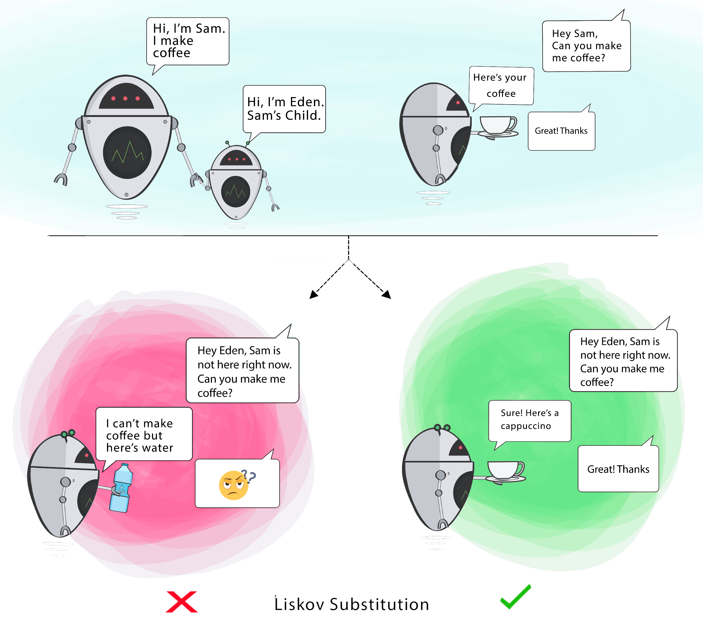

#[L]iskov Substitution Principle (Princípio substituição de Liskov)

Uma classe derivada deve ser substituível por sua classe base.
O LSP completa o princípio aberto/fechado, pois quando criamos subclasses seguindo o LSP, conseguimos fechar ainda mais nossa classe base para modificações.



```
public class L_LiskovSubstituitionProblem {

    @Getter
    @Setter
    private static class BasicAccount {
        protected double balance = 0;

        public void yield() {
            this.balance += (this.balance * 0.15);
        }
    }

    private static class SalaryAccount extends BasicAccount{
        @Override
        public void yield() {
            throw new UnsupportedOperationException("Salary account can't yield");
        }
    }

    public static void main(String[] args) {
        List<BasicAccount> accountList = new AccountDAO().getAllAccounts();
        accountList.forEach(account -> account.yield());
    }
}
```

```
public interface Car {

    void turnOnEngine();
    void accelerate();
}

public class MotorCar implements Car {

    private Engine engine;

    //Constructors, getters + setters

    public void turnOnEngine() {
        //turn on the engine!
        engine.on();
    }

    public void accelerate() {
        //move forward!
        engine.powerOn(1000);
    }
}

public class ElectricCar implements Car {

    public void turnOnEngine() {
        throw new AssertionError("I don't have an engine!");
    }

    public void accelerate() {
        //this acceleration is crazy!
    }
}
```


### [SOLID Principles: melhorando o design do seu código](https://www.zup.com.br/blog/design-principle-solid)
### [The S.O.L.I.D Principles in Pictures](https://medium.com/backticks-tildes/the-s-o-l-i-d-principles-in-pictures-b34ce2f1e898)
### [A Solid Guide to SOLID Principles](https://www.baeldung.com/solid-principles)

