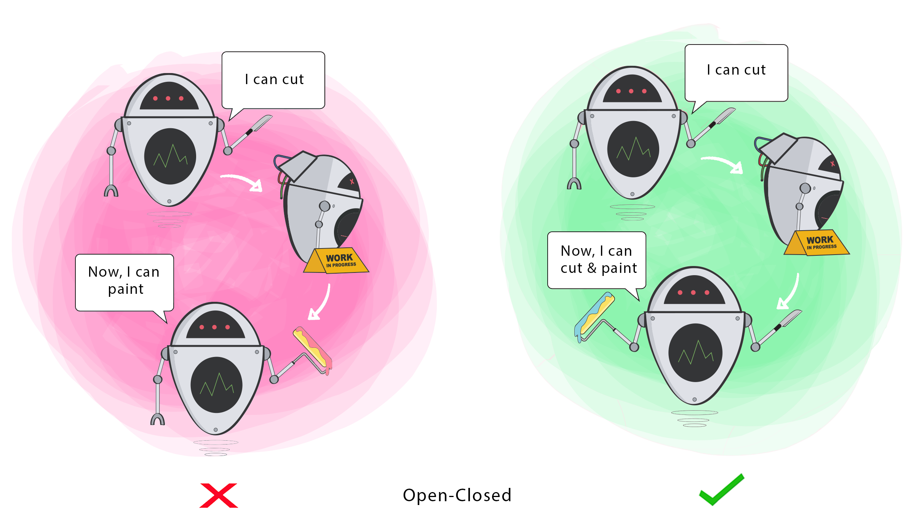

#[O]pen/Closed Principle (Princípio aberto/fechado)

Entidades de software (classes, módulos, funções e etc) devem estar abertas para extensão, porém fechadas para modificações.



```
public class O_OpenClosedProblem {

    private static class AuthenticateLogin{
        public boolean login(User user, String provider){
            ConnectionDAO connectionDAO = new ConnectionDAO("root", "");
            Connection connection = connectionDAO.createConnection();

            if(provider.equalsIgnoreCase("Linkedin")){
                //autêntica o login com o Oauth Linkedin
            }
            else{
                //autêntica o login com informações do banco de dados
            }
        }
    }
}
```

```
public class Guitar {

    private String make;
    private String model;
    private int volume;

    //Constructors, getters & setters
}

public class SuperCoolGuitarWithFlames extends Guitar {

    private String flameColor;

    //constructor, getters + setters
}
```

### [SOLID Principles: melhorando o design do seu código](https://www.zup.com.br/blog/design-principle-solid)
### [The S.O.L.I.D Principles in Pictures](https://medium.com/backticks-tildes/the-s-o-l-i-d-principles-in-pictures-b34ce2f1e898)
### [A Solid Guide to SOLID Principles](https://www.baeldung.com/solid-principles)

