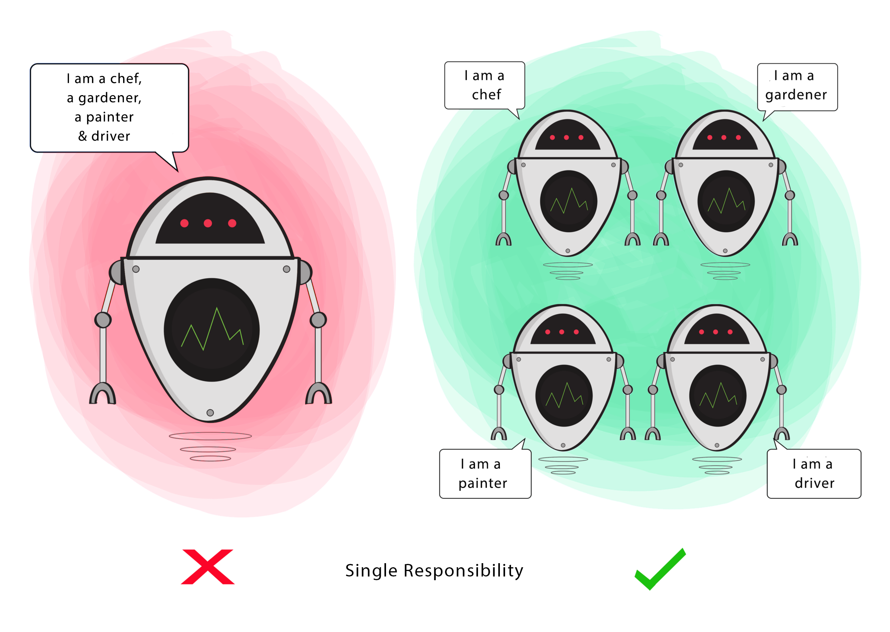

#[S]ingle Responsibility Principle (Princípio da responsabilidade Única)

Este princípio prega que uma classe deve ter apenas um motivo para mudar. Em outras palavras, Uncle Bob está falando sobre coesão. Você pode entender coesão como sendo o quão forte é a relação entre os elementos de uma classe, se essa relação é forte, os elementos têm uma alta afinidade entre si. Quanto mais bem definida uma classe é, maior a sua coesão. Quando mais coesa, menos motivos terá para mudar. Ficou difícil? Então vamos para o código.

* Testing – A class with one responsibility will have far fewer test cases.
* Lower coupling – Less functionality in a single class will have fewer dependencies.
* Organization – Smaller, well-organized classes are easier to search than monolithic ones.



```
public class S_SingleResponsabilityProblem {
@Getter
@Setter
private static class Employee {
private Long id;
private String name;
private double salary;
private String jobTitle;

        private static final String URL = "jdbc:mysql://localhost:3306/employee?useSSL=false";

        public boolean login() {
            //Abre conexão com o banco e realiza o login do empregado no sistema
        }
    }
}
```

```
public class Book {

    private String name;
    private String author;
    private String text;

    //constructor, getters and setters

    // methods that directly relate to the book properties
    public String replaceWordInText(String word){
        return text.replaceAll(word, text);
    }

    public boolean isWordInText(String word){
        return text.contains(word);
    }
    
    void printTextToConsole(){
        // our code for formatting and printing the text
    }
}
```

### [SOLID Principles: melhorando o design do seu código](https://www.zup.com.br/blog/design-principle-solid)
### [The S.O.L.I.D Principles in Pictures](https://medium.com/backticks-tildes/the-s-o-l-i-d-principles-in-pictures-b34ce2f1e898)
### [A Solid Guide to SOLID Principles](https://www.baeldung.com/solid-principles)

